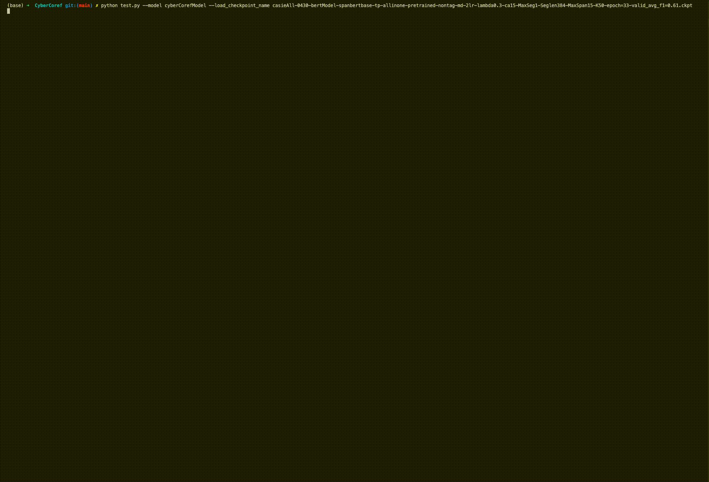

# CyberCoref: Coreference Resolution for Cybersecurity Corpus

This repository contains codes and models for the paper, **Coreference Resolution for Cybersecurity Entity: Towards Explicit, Comprehensive Cybersecurity Knowledge Graph with Low Redundancy**, which has been submitted to the SecureComm 2022. The implementation of CyberCoref and other replicated models are built on the pytorch-lighting framework and refers to the [ubc-coref](https://github.com/grig-guz/ubc-coref), [wl-coref](https://github.com/vdobrovolskii/wl-coref), and [coreference-resolution](https://github.com/shayneobrien/coreference-resolution). Thanks so much for their wonderful works.

## Setup

The following instruction are tested on the Ubuntu 18.04 with PyTorch v1.10 installed.

Firstly, download all the dependencies, which includes the nltk package for spliting sentences and tokens and the stanza package for syntactic analysis:
```
./Scripts/setup.sh
```
By the way, if you meet any error about the SSL certificate when downloading the 'punkt', you should try downloading it by executing the `./Scripts/downloadNLTK.py` 

Secondly, make sure you can access to the external network, since the code will automaticlly download the pre-trained BERT model from [the Humming Face](https://huggingface.co/). Otherwise, you should download the pre-trained BERT to the `./BERTs/` directory by yourself first, for example `./BERTs/spanbert-base-cased`, and revise the code related to loading BERT models.
 
Finally, annotated data with the BRAT form (i.e. .txt file and .ann file for each document) should be put under the `./Dataset/rawData/` directory. Currently, if you want to access to our dataset, please contact Prof.Cheng Huang by codesec\[at\]scu.edu.cn.

## Training

### Preparing training and validation samples
It should be noted that there still serval steps to go from the raw data to the dataset ready for training and validation. Therefore, the Document class and its variants are defind in the `dataLoader.py` for better completing those steps. Each sample, i.e. a document, will create an object of those class. And the whole training dataset or validation dataset will be collected as an object of the Corpus class and saved to a .pkl file.
```
python dataLoader.py --model cyberCorefModel --bert_based --bert_name spanbert-base --max_segment_len 384 --corpus_subpath casieAll_0430 --corpus_filename _corpus_cyber.pkl --train_val_ratio 0.2
```
Then, the processed training and validation dataset would be saved to the `./Dataset/casieAll_0430/train_corpus_cyber.pkl` and `./Dataset/casieAll_0430/valid_corpus_cyber.pkl`

### Pre-train the type prediction network by the entity type prediction subtask
More details of the type prediction network and the subtask are in the paper. The pre-trained network's weights should be saved in the `./Weights` directory and will be loaded when training the CyberCoref model as a whole. However, our pretrained nwtwork's weights can be find as `./Weights/tp-spanbert-without-tag-md-epoch=19-valid_weighted_f1=0.79.ckpt`, which is ready use directly. Due to single file size limitation, please visit [this address]() for model weights.

If you want to train the type prediction network with the custom entities datatset by yourself, please refer to the `spanDataloader.py` and the `tp_train.py`.

### Train the overall model
There are important config keys in the `config.py` should be setup before start training. The following command is a example to train the CyberCoref model.

```
python train.py --corpus_subpath casieAll_0430 --corpus_filename _corpus_cyber.pkl --model cyberCorefModel --bert_based --bert_name spanbert-base --tp_solution without-tag-md --segment_max_num 1 --max_epochs 50 --scheduler CosineAnnealingLR --scheduler_T_max 15 --max_span_length 20 --prune_lambda 0.3 --save_checkpoint --checkpoint_name casieAll-0430-bertModel-spanbertbase-tp-allinone-pretrained-nontag-md-2lr-lambda0.3-ca15-MaxSeg1-Seglen384-MaxSpan15-K50-{epoch:02d}-{valid_avg_f1:.2f}
```

## Prediction
For the prediciton of the given documents with the trained model:

Firstly, make sure that each given raw document is processed and stored as an object of class CyberDocument, which is defined in the dataLoader.py. All documents waiting to be predicted need to be integrated into the object of the corpus class and saved to a .pkl file, just like what we do in the training step.

Secondly, the trained model weights should be saved in the `./Weights` directory.

Finally, you can run the following command to predict:
```
python test.py --model cyberCorefModel --load_checkpoint_name casieAll-0430-bertModel-spanbertbase-tp-allinone-pretrained-nontag-md-2lr-lambda0.3-ca15-MaxSeg1-Seglen384-MaxSpan15-K50-epoch=33-valid_avg_f1=0.61.ckpt
```

